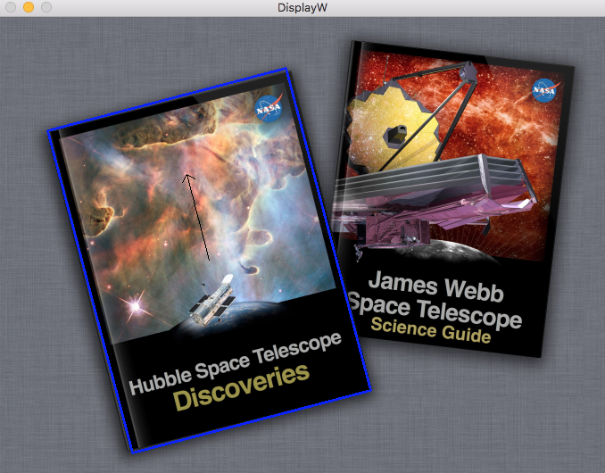
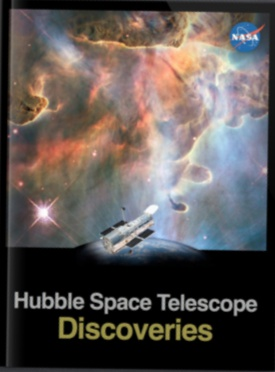
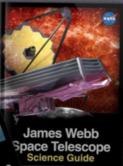
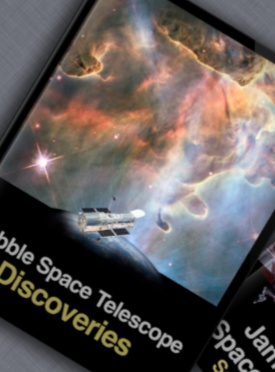
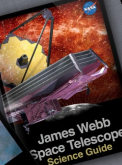
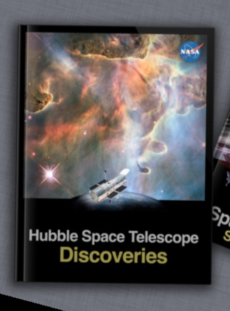
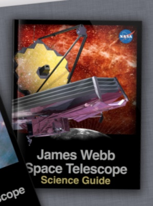
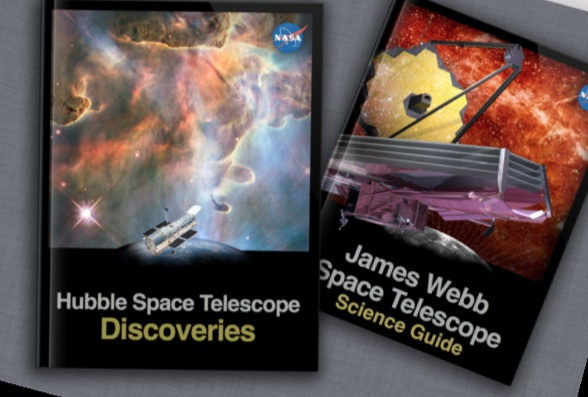

# Fast Image Data Annotation Tool

A tool to

- annotate images for image classification, optical character reading (digit classification, letter classification), ...

- extract data into different format (Caffe LMDB, OpenCV Cascade Classifiers, Tesseract ... ) with data augmentation (resizing, noise in translation / rotation / scaling, pepper noise , gaussian noise, rectangle merging, line extraction ...)

The philosophy and advantages of this tool is

- to enable fast annotation : annotate data just by selecting the diagonal of the object, for a fixed ratio. Press Enter if the class is always the same. Type the letter of the class otherwise,

- to be re-usable for different scenarios, and leave you free to build any other tool as input of the annotation process, using any pre-existing weaky classifier (depending on your case) or bounding box proposal algorithm such as selective search, to facilitate annotation with a list of rectangles to select or discard, by just typing the letter of the class or ESCAPE KEY,

- to have the extraction tool act like a monad, so that you can apply transformation in any order, at any stage of your process, the format remaining the same : given a directory and a CSV file, extraction tool will produce a new directory and CSV file, in the same format, by default,

- to feed any classification / training process,

- to be usable for visualisation and export : a visual check that the data is correctly annotated, after manual annotation, extraction, or even after your own bounding box prediction algorithm if it uses the Output class to its produce results.

Requires OPENCV and Google Protobuf.

### File format

Rectangle extraction tools create annotations CSV files in the RotatedRect file format. [This blog post will give you the reasons motivating this choice](http://christopher5106.github.io/computer/vision/2015/12/26/file-format-for-computer-vision-annotations.html).


### Annotation tool

```bash
./bin/annotateRect [FLAGS] input_dir output_file.csv
```

A tool used to annotate rectangles or to show the results (rectangles with `--init` option).


**Meaning of the colors** :

- blue rectangle : currently active rectangle to annotate

- green rectangles : remaining rectangles to annotate. Use `--init init_file.csv` option to feed rectangles to annotate to the annotation tool.

- yellow rectangles : annotated rectangles

**Add a rectangle or modify the rectangle** with the following keys :

- Click with the mouse to set the center of the active rectangle (blue) or create a new active rectangle at this position.

- Use arrow keys to move the active rectangle (blue)

    - move left (left arrow key)
    - move right (right arrow key)
    - move up (up arrow key)
    - move down (down arrow key)

- Press **FN** while using arrow keys to change orientation/scale of the active rectangle (blue)

    - rotate left (left arrow key)
    - rotate right (right arrow key)
    - augment size (up arrow key)
    - downsize (down arrow key)

- **BACKSPACE**: erase the currently active rectangle.

- **ESC**: next init rectangle or next image (without save)

**Annotate the class** with :

- **Any letter**: save the currently active rectangle (blue) with this letter as category / class . For example "0", if there is only one category. The blue rectangle will become yellow.

- **ENTER**: save the letter with the same class as previously.


FLAGS :

- `--ratio 1.0` is the ratio height/width of the annotation rectangles.

- `--cross` display a cross instead of a rectangle for non-current rectangles, ie previous (yellow) or future (green) rectangles. This is a useful display option when rectangles are too close together.


- `--init init_file.csv` to initialize the rectangles instead of selecting them manually (appear in green). The first one of them will be use as the currently active rectangle (blue). You can still add new rectangles when all init rectangles (green or blue) have been annotated.

- `--export=output_dir` will not display annotation interface. Saves the annotated images to directory.

NOTES :

- the annotation tool can be stopped and launched again : it will resume the work from *output_file.csv*, previously annotated rectangles appear in yellow.

- in case the init rectangles are bigger than the image, a white border is added to the image to show the rectangles outside the image.

- although annotation tool can read images in an output_file.csv or init_file.csv outside current exe directory (by adding the CSV dir to the image path), it will save images with the input_dir as base path. So, when annotating, execute the command in the same directory as the output_file.csv.

EXAMPLE :

Annotate images in the current directory :

```bash
./bin/annotateRect . out.csv -ratio 1.35
```

A first image will appear :


To annotate fast, just select the diagonal, by clicking first the top left corner of the object, then the bottom right corner, as shown here with the red arrows :


Image is now selected and appear in blue:



Press the key corresponding to its class, for example 'a'. Now it appears in yellow.


Select the second book.


And press the key corresponding to its class, for example 'e'.


The output annotation file in CSV format *out.csv* will look like :

```
./pic.jpg,a,709,816,826,1116,-14.6958
./pic.jpg,e,1510,607,741,1001,6.32224
```

At any time, you can view how the annotations are, and potentially add new annotations with the same command :

```bash
./bin/annotateRect . out.csv -ratio 1.35
```


### Extraction tool

Use annotation information to extract a version of the images :

```bash
./bin/extractRect [FLAGS] annotations.csv output_dir
```

Moreove, the tool will create an output CSV file listing the new rectangle coordinates in the format `path,label,center_x,center_y,width,height,rotation,noise_x,noise_y,noise_rotation,noise_scale`.

Extraction extracts at best quality possible.

Image will be rotated so that annotation window will be parallel to the image borders.

For example in the previous example,

```bash
./bin/extractRect out.csv out
```

will create an output directory *out* with two subdirectories corresponding to each label, *out/a* and *out/b* and its corresponding extracted objects, and a CSV file *out/results.csv* with image path, labels and new rectangle coordinates after the extraction.

 

Extract with a noise in rotation with `./bin/extractRect out3.csv out8 --noise_rotation=30`

 

Several options such as noise in translation, scale, or pepper/gaussian noise are available.

The `--full_image` option makes transformation available without extracting the rectangle.

See below for more options.

INPUT SELECTION FLAGS :

- `--input_class_filter` select entries of the specified class only.

- `--limit` limit the number of annotation rectangles to consider, good for debuging purposes.

EDIT RECTANGLES

- `--skip_rotation` skips rotation information in annotation (all set to 0.0).

- `--factor=1.2` extends the extraction box by a factor of the width and height. `--factor_width` and `--factor_height` do the same on one axis only and are cumulative with `--factor` (multiplication). In the example, `./bin/extractRect out.csv out7 --factor 1.2`

 


- `--offset_x` and `--offset_y` add an offset on each axis of the rectangle, in percentage of the width of the rectangle.

- `--merge` : if multiple bounding box per images, will extract the global bounding box containing all rectangles in each image. In the example : `./bin/extractRect out.csv out --merge` will produce :




- `--merge_line` : If multiple rectangle per images, merge rectangles that are roughly on the same line.

- `--correct_ratio` : corrects the ratio of the annotated rectangles to the specified `--ratio` by augmenting one of the two dimensions (height or width). Default is false.

- `--add_borders=true` : adds borders to the extracted image to fit the ratio. Default is false. Available only when `--resize_width` not zero.

- `--ratio=1.0` is used in combination to `--correct_ratio` or `--resize-width` options. It defines the ratio (height/width) of the window to extract. The use of `--resize-width` option without `--correct_ratio` will stretch the image to final dimensions.

NOISE FLAGS

- `--noise_translation=0.2` adds a noise in translation of 20% of the width/height. Not taken into consideration for negatives generation. `--noise_translation_offset` can be used to specify a mininum noise (for negative generation for example).

- `--noise_rotation=30` adds a noise in rotation in `[-noise_rotation°,noise_rotation°]`.

- `--noise_zoomin=2 --noise_zoomout=3` adds a noise in scale factor uniformly distributed in `[1/3,200%]`. Not taken into consideration for negatives generation and in `--full_image` mode.

- `--pepper_noise=0.1 --gaussian_noise=30` adds a pixel noise

- `--samples` is the number of sample to extract per image. Default is 1. Useful in combination with noise option.


OUTPUT FLAGS

- `--full_image` will not extract the rectangle along the given annotation. Always true in `--backend=opencv` output mode.

- `--resize_width=400` resizes the output to a width of `resize_width` and a height of `resize_width*ratio`. `--resize_width=0` will not resize the output. Default value is no resize. Not available in `--full_image` and `--backend=opencv` mode.

- `--gray=true` extracts as a gray image. Default is false. Always true in `--backend=opencv` output mode.

- `--neg_per_pos=1 --neg_width=0.3` defines the number of negative sample to extract per positives and the width of the capture window in percentage to the width of the image (30%). By default, no negative (0).

- `--backend=directory` defines the output format for storing the results. Possible values are : directory, lmdb, tesseract, opencv. Default value is directory.

- `--output_class` override the class by the specified class

- `--output_by_label=false` avoids creation of different output directories per label. Available for `--backend=directory` only.

- `--append` append new extracts to an existing directory. Available for `--backend=directory` only.


NEGATIVE GENERATION

- `--neg_width=0.2` defines the width of negative samples to extract, in pourcentage to the largest image dimension (width or height)

- `--neg_per_pos` defines the number of negative samples per positives to extract.


# License conditions

Copyright (c) 2016 Christopher5106

This tool has been developped for a work at Axa, and is a contribution to OpenSource by Axa.

This program is free software; you can redistribute it and/or modify it under the terms of the GNU General Public License as published by the Free Software Foundation; either version 2 of the License, or (at your option) any later version.

This program is distributed in the hope that it will be useful, but WITHOUT ANY WARRANTY; without even the implied warranty of MERCHANTABILITY or FITNESS FOR A PARTICULAR PURPOSE. See the GNU General Public License for more details.

You should have received a copy of the GNU General Public License along with this program; if not, write to the Free Software Foundation, Inc., 51 Franklin Street, Fifth Floor, Boston, MA 02110-1301, USA.
